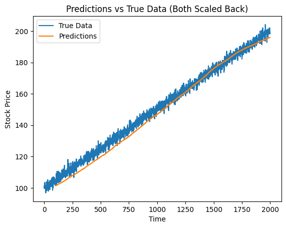

# Advanced Transformer for stock-price Time-Series Forecasting

## Overview

This project builds and trains a Transformer-based neural network to predict the next value in a stock-price time series using the previous 100 values.

The notebook does not use real market data. It first generates a synthetic stock-price dataset with an upward trend plus noise, then prepares that data for supervised learning, defines custom Transformer components, trains the model, and plots predicted values against the true series.

## What the Project Does

1. Checks whether the required Python packages are installed.
2. Imports the main libraries used in the notebook.
3. Creates a synthetic stock-price dataset and saves it as `stock_prices.csv`.
4. Loads the `Close` column from the CSV file.
5. Scales the data to the range `[0, 1]` using `MinMaxScaler`.
6. Converts the time series into supervised learning samples:
   - each input sample contains 100 consecutive past prices
   - each target is the next price after that window
7. Reshapes the inputs into 3D format so they can be passed to the model as sequence data.
8. Implements a custom `MultiHeadSelfAttention` layer.
9. Implements a custom `TransformerBlock` with:
   - self-attention
   - feed-forward network
   - residual connections
   - layer normalization
   - dropout
10. Stacks multiple Transformer blocks into a `TransformerEncoder`.
11. Builds a prediction model with:
   - input layer
   - dense projection to embedding dimension
   - Transformer encoder
   - flatten layer
   - final dense output layer
12. Compiles the model using:
   - Adam optimizer
   - mean squared error loss
13. Trains the model for 20 epochs with batch size 32.
14. Generates predictions on the prepared sequence data.
15. Converts predictions back to the original price scale.
16. Plots predicted values against the true time series.

## Technical Details

### Data Generation
The notebook creates synthetic stock prices instead of downloading external financial data. The generated series is:

- a linear upward trend from 100 to 200
- plus Gaussian noise

This makes the project a controlled time-series forecasting example rather than a real trading system.

### Data Preparation
The time series is converted into sliding windows.

If the sequence is:

`[x1, x2, x3, ..., x100]`

then the model learns to predict:

`x101`

So the learning task is next-step forecasting from a fixed-length historical window.

### Model Architecture
The model is based on a Transformer encoder rather than an LSTM.

Main components:

- **Dense input projection**: maps the raw 1-feature sequence into a higher-dimensional embedding space
- **Multi-head self-attention**: lets each time step attend to other time steps in the input window
- **Feed-forward network**: processes the attended representation
- **Residual connections**: help stabilize deep learning
- **Layer normalization**: improves training stability
- **Dropout**: reduces overfitting
- **Stacked encoder blocks**: increases model capacity
- **Flatten + Dense output**: converts sequence representations into a single numeric prediction

### Hyperparameters Used

- `time_step = 100`
- `embed_dim = 128`
- `num_heads = 8`
- `ff_dim = 512`
- `num_layers = 4`
- `dropout rate = 0.1`
- `epochs = 20`
- `batch_size = 32`

## Packages Used

- `numpy`
- `pandas`
- `tensorflow`
- `scikit-learn`
- `matplotlib`
- `seaborn`
- `pyarrow`
- `requests`

## Main TensorFlow / Keras Components Used

- `tf.keras.Input`
- `tf.keras.Model`
- `tf.keras.Sequential`
- `tf.keras.layers.Layer`
- `tf.keras.layers.Dense`
- `tf.keras.layers.Dropout`
- `tf.keras.layers.LayerNormalization`

## Why This Project Is Technically Interesting

- It implements **custom Transformer layers manually** instead of only using high-level built-in layers.
- It applies **self-attention to time-series forecasting**.
- It shows how to turn a 1D sequence into a supervised learning dataset using a sliding window.
- It demonstrates an end-to-end deep learning pipeline:
  - synthetic data creation
  - preprocessing
  - sequence construction
  - model definition
  - training
  - inverse scaling
  - visualization
- It uses a **Transformer encoder for regression**, not classification or NLP.

## Limitations

- The dataset is synthetic, so results do not reflect real stock-market behavior.
- The model is trained and evaluated on the same prepared sequence set in the notebook.
- There is no train/test split or validation pipeline.
- There is no positional encoding added explicitly.
- This is a forecasting demo, not a production-ready financial model.

## Files

- `advancedTransformers.ipynb` — main notebook
- `stock_prices.csv` — generated synthetic dataset

## Summary

This project is a Transformer-based time-series forecasting notebook that generates synthetic stock-price data, transforms it into sliding-window training samples, builds a custom multi-head self-attention encoder in TensorFlow/Keras, trains the model to predict the next value in the sequence, and visualizes predictions against the original series.


```
